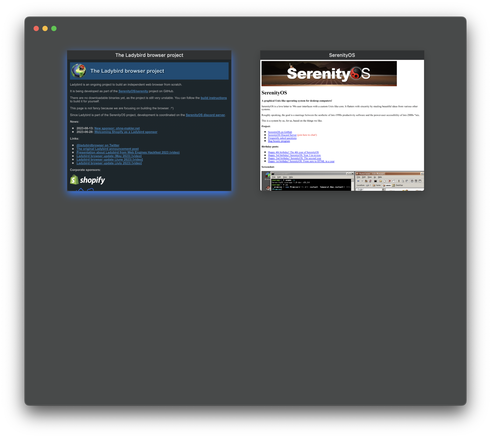

# Ladybird - AppKit UI

This project provides an AppKit-based chrome for the [SerenityOS LibWeb](https://github.com/SerenityOS/serenity)
web engine for macOS.

⚠️ This has only been tested on macOS 13.4.1 with Xcode 14.3.1.

## Build Instructions

```bash
cmake -G Ninja -B Build
ninja -C build
```

## Running Ladybird

```bash
./Build/Ladybird.app/Contents/MacOS/Ladybird
```

Or

```bash
open ./Build/Ladybird.app
```

## Screenshots



